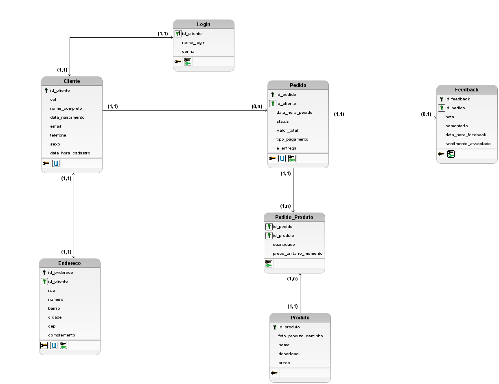

# 🍕 PizzaPulse — Sistema Inteligente para Pizzarias com Assistente Autônomo de IA


> **PizzaPulse** é uma plataforma completa de gestão e atendimento inteligente para pizzarias, impulsionada por um **Assistente Autônomo de IA**. O sistema automatiza o fluxo de atendimento ao cliente via Chatbot e centraliza a operação do estabelecimento em um painel administrativo moderno e analítico.

---

## 📌 Sobre o Projeto

O **PizzaPulse** foi desenvolvido para resolver gargalos operacionais no atendimento de delivery e salão, eliminando filas de espera e otimizando a captação de pedidos. Através de um agente de Inteligência Artificial autônomo, o cliente realiza todo o seu atendimento de forma fluida e natural, enquanto o gestor acompanha métricas estratégicas em tempo real.

---

## 🚀 Funcionalidades Principais

### 🤖 1. Assistente Autônomo de IA (Chatbot Inteligente)
O coração da aplicação. Diferente de chatbots tradicionais baseados em árvores engessadas de decisão, a IA autônoma do **PizzaPulse** é capaz de:
* **Cadastrar Clientes:** Identifica e registra novos clientes de forma conversacional durante a interação.
* **Exibir Cardápio Interativo:** Apresenta produtos, sabores, tamanhos e adicionais dinamicamente.
* **Realizar Pedidos Fim a Fim:** Processa as escolhas do cliente, calcula o valor total, valida a forma de pagamento e insere o pedido diretamente no banco de dados. Em outras palavras, quando o cliente conversa com o chatbot, a experiência não é engessada como nos métodos tradicionais — em que é preciso digitar '1' para atendimento e, se o usuário escolher outra opção, o sistema se perde facilmente, tornando o processo estressante.

### 📊 2. Painel de Analytics & Vendas
Painel executivo construído com **Streamlit, Pandas e Plotly** para tomada de decisão baseada em dados:
* **Métricas em Tempo Real:** Faturamento Total, Total de Produtos Vendidos e Ticket Médio por Cliente.
* **Gráfico de Evolução:** Histórico temporal do faturamento com gráfico de área preenchida.
* **Meios de Pagamento:** Distribuição percentual do faturamento por forma de pagamento (Pix, Cartão, Dinheiro).
* **Rankings e Desempenho:** Produtos mais vendidos (Valor vs. Quantidade) e Top 10 Clientes que mais consumiram.
* **Tabela Geral de Vendas:** Consulta detalhada de histórico de pedidos. Resumo da ópera: o administrador e dono do negócio tem uma visão geral das vendas da pizzaria de maneira rápida e fácil.

### 👥 3. Gestão e Listagem de Clientes
* Visualização da base de clientes cadastrados pelo sistema/chatbot.
* Histórico de consumo individual e dados de contato.

### 🍕 4. Gestão do Cardápio
* Módulo para listagem e consulta dos produtos, preços e categorias disponíveis na pizzaria.
Outras funcionalidades como, por exemplo, inclusão e análise de sentimento de feedback ainda não estão incluídas.
---

## 🛠️ Tecnologias Utilizadas

* **Linguagem:** Python
* **Interface Administrativa:** Streamlit
* **Análise e Visualização de Dados:** Pandas, Plotly Express & Graph Objects
* **Banco de Dados:** SQLite
* **Inteligência Artificial:** Agente/Assistente Autônomo de IA integrado via API (LangChain / OpenAI / LLM)
O modelo de IA Generativa usado foi o Google Gemini, versão gemini-3.1-flash-lite por meio de API.
---
### Riscos de Alucinação e Confiabilidade
Embora o modelo `gemini-3.1-flash-lite` ofereça alta performance e baixa latência para inferências textuais e estruturadas, modelos de linguagem generativa (LLMs) estão sujeitos ao fenômeno de **alucinação** — situações em que o modelo gera informações plausíveis do ponto de vista gramatical e sintático, mas factualmente incorretas, imprecisas ou desconectadas da base de dados real.

#### Principais Riscos Mapeados:
1. **Invenção de Dados do Domínio:** Ao interpretar dados do sistema (como itens de menu, ingredientes ou valores de pedidos), a IA pode gerar respostas baseadas no seu treinamento geral em vez de se limitar estritamente às tabelas do banco de dados (ex: inventar um sabor de pizza inexistente na tabela `produto`).
2. **Interpretação de Sentimentos em Feedback:** Na análise de campo livre da tabela `feedback`, o atributo `sentimento_associado` pode ser classificado erroneamente caso o comentário do cliente contenha sarcasmo, ironia ou regionalismos.
3. **Consistência de Chaves e Consultas:** Ao traduzir intenções do usuário em consultas estruturadas (ex: Text-to-SQL ou chamadas de funções), o modelo pode alucinar IDs de clientes, pedidos ou colunas que não existem no esquema do banco.
Por isso, em casos de erros da aplicação, o usuário deve reportar o caixa para prosseguir com o atendimento via telefone ou whatsapp.

## 📂 Estrutura do Projeto

```text
pizzaria/
├── abas/
│   ├── analytics.py        # Módulo de dashboards e métricas de vendas
│   ├── chatbot.py          # Interface do assistente autônomo de IA
│   ├── clientes.py         # Módulo de listagem e gestão de clientes
│   └── cardapio.py         # Módulo de visualização do cardápio
├── code/
│   └── funcoes_bd.py       # Consultas, agregadores e conexões SQLite
│   └── funcoes_validacoes.py # Métodos de validação dos dados de entrada como, por exemplo CPF, CEP.
│   └── logger_config.py    # Métodos de configuração de log
├── app.py                  # Aplicação principal (Streamlit Multipage)
├── bases/pizzaria.db       # Banco de dados SQLite
└── README.md               # Documentação geral do projeto 
└── LICENCE.txt             # Documento de Licença do projeto com as diretrizes de uso.
└── requirements.txt        # Lista de pacotes, bibliotecas externas do projeto. Tem nome, versão de cada.
├── imagens/                # Imagens dos produtos, cardápio.
├── modelos_banco/          # Arquivos de modelo conceitual, lógico e físico do banco de dados
├── logs/                   # Arquivo de log gerado durante a execução do programa.
```


# Documentação do Banco de Dados

Este repositório contém a documentação técnica da modelagem de dados do projeto.

---

## 1. Modelo Lógico

### Visão Geral
*O domínio do negócio consiste de informações sobre: Cliente, Endereço, Login, Pedido, Produto, Feedback e Pedido_Produto(Item)*

### Diagrama
<!-- Adicione a imagem do diagrama lógico ou cole o código Mermaid/PlantUML abaixo -->


### Regras de Negócio e Relacionamentos
- **Cliente x Endereço:** Um cliente tem apenas um único endereço e este somente pode pertence a um único cliente, relacionamento 1x1.
- **Cliente:** O cliente é identificado através do campo id_cliente, número sequencial gerado pelo sistema. O cliente pode ser identificado tanto pelo id_cliente também como CPF. 
- **Endereço:** Seguindo o mesmo raciocínio do ID vinculado ao cliente, a entidade `Endereço` é identificada de forma única através do campo `id_endereco`.
- **Demais Entidades:** As entidades `Pedido`, `Pedido_Produto`, `Login`, `Produto` e `Feedback` seguem esse mesmo princípio de identificação através de seus respectivos campos de ID (`id` / `id_[nome_da_entidade]`).
- **Cliente x Login:** Um cliente tem apenas um único login associado e este somente pode pertence a um único cliente, relacionamento 1x1.
- **Cliente x Pedido:** Um cliente pode realizar nenhum ou vários pedidos, relacionamento 0xn. Porém um Pedido obrigatoriamente pertencerá a um único cliente, 1x1. Pedido pode ser interpretado como venda.
- **Pedido x Pedido_Produto:** Representa o carrinho da compra, pedido. São os itens como, por exemplo, pizzaria. Temos a quantidade e o respectivo preço de cada item. Um pedido terá pelo menos um item ou pode ter vários, 1xn. Um item obrigatoriamente pertencerá somente a um Pedido, 1x1.
- **Produto x Pedido_Produto:** É a referência do produto dado o item do carrinho. Relacionamento: 1x1
- **Pedido x Feedback:** Um pedido pode ter um feedback ou não, relacionamento 0x1. Um feedback,postado pelo cliente, obrigatoriamente pertencerá a um único pedido, 1x1

## 2. Dicionário de Dados

Esta seção detalha a estrutura de todas as tabelas do banco de dados, incluindo seus atributos, tipos de dados, restrições, relacionamentos e exemplos práticos.

---

### Tabela: `cliente`
*Armazena as informações cadastrais dos clientes do sistema.*

| Coluna | Tipo de Dado | Nulo? | Chave | Descrição / Observações | Exemplo |
| :--- | :--- | :--- | :--- | :--- | :--- |
| `id_cliente` | INTEGER | Não | PK | Identificador único do cliente (Auto Incremento) | `1` |
| `cpf` | VARCHAR(11) | Não | Unique | CPF do cliente (apenas números, valor único) | `12345678901` |
| `nome_completo` | VARCHAR(150) | Não | - | Nome completo do cliente | `Maria Silva` |
| `data_nascimento` | DATE | Sim | - | Data de nascimento do cliente | `1995-08-20` |
| `email` | VARCHAR(100) | Sim | - | Endereço de e-mail do cliente | `maria.silva@email.com` |
| `telefone` | VARCHAR(20) | Sim | - | Número de telefone/celular do cliente | `11987654321` |
| `sexo` | VARCHAR(10) | Sim | - | Gênero/sexo do cliente | `Feminino` |
| `data_cadastro` | DATETIME | Não | - | Data e hora do cadastro (Padrão: `CURRENT_TIMESTAMP`) | `2026-08-12 14:30:00` |

---

### Tabela: `login`
*Gerencia as credenciais de acesso dos clientes ao sistema.*

| Coluna | Tipo de Dado | Nulo? | Chave | Descrição / Observações | Exemplo |
| :--- | :--- | :--- | :--- | :--- | :--- |
| `id_cliente` | INTEGER | Não | PK / FK | Identificador do cliente e PK da tabela. Referencia `cliente(id_cliente)` (Cascade Delete) | `1` |
| `nome_usuario` | VARCHAR(100) | Não | Unique | Nome de usuário único para autenticação | `mariasilva95` |
| `senha` | VARCHAR(255) | Não | - | Hash da senha de acesso do usuário | `$2a$12$eImiTXu...` |

---

### Tabela: `endereco`
*Registra os endereços de entrega associados aos clientes (Relacionamento 1:1).*

| Coluna | Tipo de Dado | Nulo? | Chave | Descrição / Observações | Exemplo |
| :--- | :--- | :--- | :--- | :--- | :--- |
| `id_endereco` | INTEGER | Não | PK | Identificador único do endereço (Auto Incremento) | `10` |
| `id_cliente` | INTEGER | Não | FK / Unique | Identificador do cliente associado. Referencia `cliente(id_cliente)` (Cascade Delete) | `1` |
| `rua` | VARCHAR(50) | Não | - | Nome do logradouro/rua | `Rua das Flores` |
| `numero` | INTEGER | Não | - | Número da residência/estabelecimento | `123` |
| `bairro` | VARCHAR(100) | Não | - | Nome do bairro | `Jardim Paulista` |
| `cidade` | VARCHAR(100) | Não | - | Nome da cidade | `São Paulo` |
| `cep` | VARCHAR(10) | Não | - | Código de Endereçamento Postal (CEP) | `01234000` |
| `complemento` | VARCHAR(50) | Sim | - | Informações complementares | `Apto 42B` |

---

### Tabela: `pedido`
*Armazena o cabeçalho dos pedidos realizados pelos clientes.*

| Coluna | Tipo de Dado | Nulo? | Chave | Descrição / Observações | Exemplo |
| :--- | :--- | :--- | :--- | :--- | :--- |
| `id_pedido` | INTEGER | Não | PK | Identificador único do pedido (Auto Incremento) | `501` |
| `id_cliente` | INTEGER | Não | FK | Cliente solicitante. Referencia `cliente(id_cliente)` | `1` |
| `data_hora_pedido` | DATETIME | Não | - | Data e hora em que o pedido foi feito (Padrão: `CURRENT_TIMESTAMP`) | `2026-08-12 19:45:10` |
| `valor_total` | DECIMAL(10, 2) | Não | - | Valor total acumulado do pedido em reais | `85.50` |
| `tipo_pagamento` | VARCHAR(50) | Não | - | Forma de pagamento escolhida | `Pix` |

---

### Tabela: `produto`
*Catálogo de itens disponíveis na pizzaria (pizzas, bebidas, sobremesas, etc.).*

| Coluna | Tipo de Dado | Nulo? | Chave | Descrição / Observações | Exemplo |
| :--- | :--- | :--- | :--- | :--- | :--- |
| `id_produto` | INTEGER | Não | PK | Identificador único do produto (Auto Incremento) | `15` |
| `foto_produto_caminho` | VARCHAR(255) | Sim | - | Caminho ou URL da imagem do produto | `/uploads/pizzas/calabresa.png` |
| `nome` | VARCHAR(100) | Não | - | Nome comercial do produto | `Pizza Calabresa Especial` |
| `descricao` | TEXT | Sim | - | Descrição detalhada do produto e seus ingredientes | `Molho de tomate, calabresa fatiada, cebola e azeitonas.` |
| `preco` | DECIMAL(10, 2) | Não | - | Preço de venda atual do produto em reais | `55.00` |

---

### Tabela: `pedido_produto`
*Tabela associativa que relaciona os produtos contidos em cada pedido (Relacionamento N:M).*

| Coluna | Tipo de Dado | Nulo? | Chave | Descrição / Observações | Exemplo |
| :--- | :--- | :--- | :--- | :--- | :--- |
| `id_pedido` | INTEGER | Não | PK / FK | Identificador do pedido. Referencia `pedido(id_pedido)` (Cascade Delete) | `501` |
| `id_produto` | INTEGER | Não | PK / FK | Identificador do produto. Referencia `produto(id_produto)` | `15` |
| `quantidade` | INTEGER | Não | - | Quantidade do item no pedido (Restrição: `quantidade > 0`) | `1` |
| `preco_unitario_momento` | DECIMAL(10, 2) | Não | - | Preço unitário do produto gravado no momento da compra | `55.00` |

---

### Tabela: `feedback`
*Registra avaliações e comentários deixados pelos clientes sobre um pedido.*

| Coluna | Tipo de Dado | Nulo? | Chave | Descrição / Observações | Exemplo |
| :--- | :--- | :--- | :--- | :--- | :--- |
| `id_feedback` | INTEGER | Não | PK | Identificador único do feedback (Auto Incremento) | `30` |
| `id_pedido` | INTEGER | Não | FK / Unique | Pedido correspondente. Referencia `pedido(id_pedido)` (Cascade Delete) | `501` |
| `nota` | INTEGER | Não | - | Pontuação do pedido (Restrição: valor entre 1 e 5) | `5` |
| `comentario` | TEXT | Sim | - | Texto livre com a opinião do cliente | `Pizza chegou quentinha e muito saborosa!` |
| `data_hora_feedback` | DATETIME | Não | - | Data e hora do envio do feedback (Padrão: `CURRENT_TIMESTAMP`) | `2026-08-12 20:30:00` |
| `sentimento_associado` | VARCHAR(50) | Sim | - | Categoria ou análise de sentimento | `Positivo` |


## 🚀 Como Executar o Projeto Localmente

### Pré-requisitos
Certifique-se de ter o **Python 3.13 ou superior** instalado em sua máquina. O projeto usa anaconda.

### Passo a Passo

1. **Clone o repositório:**
   ```bash
   git clone [https://github.com/rogercsampaio/pizzariapulse](https://github.com/rogercsampaio/pizzariapulse)
   cd pizzariapulse

2. **Configure o ambiente conda**
   2.1 Dentro do terminal anaconda, navegue até a pasta raiz do projeto. Crie um ambiente virtual usando como referência o Python 3.13. Preferencialmente nomeie o ambiente com um nome significativo como, por exemplo, pizzariapulse.
   ```bash
   conda create --name cineai python=3.13 -y
   ```

   2.2 Ative o ambiente virtual.
   ```bash
   conda activate pizzariapulse
   ```

   2.3 Instale os pacotes e as dependências necessárias usando como referência o arquivo requirements.txt localizado na pasta raiz do projeto.
   ```bash
   pip install -r requirements.txt
   ```

   2.4 Para executar dentro do terminal execute o comando abaixo. O navegador deverá ser aberto com o app.
   ```bash
   python -m streamlit run app.py
   ```

   2.5 Para encerrar a aplicação, pressione `Ctrl + C` no terminal ou feche o terminal Anaconda e a aba do navegador onde o projeto estiver rodando.

### 💡 Solução de Problemas Comuns

| Erro / Comportamento | Causa Provável | Solução |
| :--- | :--- | :--- |
| `ModuleNotFoundError` | O ambiente conda não foi ativado antes da execução. | Certifique-se de rodar `conda activate cineai` antes de iniciar a aplicação. |
| `FileNotFoundError: bases/...` | O arquivo da base de dados não está localizado no caminho correto. | Verifique se o arquivo `pizzariapulse.db` está dentro da pasta `/bases`. |
| `Port 8501 is already in use` | Já existe outra instância do Streamlit rodando em segundo plano. | Feche o processo anterior no terminal (<kbd>Ctrl</kbd> + <kbd>C</kbd>) ou acesse a porta alternativa sugerida pelo Streamlit. |


---

## 📬 Contato e Suporte

Se você tiver dúvidas, sugestões de melhoria ou encontrar algum problema técnico no projeto, entre em contato através dos canais abaixo:

* **Desenvolvedor / Responsável:** Roger Sampaio
* **E-mail:** [rogersampaioo@gmail.com](mailto:rogersampaioo@gmail.com)
* **LinkedIn:** [linkedin.com/in/roger-csampaio/](https://linkedin.com/in/roger-csampaio/)
* **GitHub:** [@rogercsampaio](https://github.com/rogercsampaio)
---

### 🐛 Reportando Problemas ou Sugestões

Caso encontre algum bug no sistema, inconsistência no banco de dados ou alucinação recorrente na IA:

1. Abra uma **[Issue](https://github.com/seu-usuario/seu-repositorio/issues)** no repositório.
2. Descreva o comportamento observado e, se possível, inclua capturas de tela ou logs de erro.
3. Sugestões de melhorias na modelagem ou nas prompts da IA também são super bem-vindas via *Pull Request*!